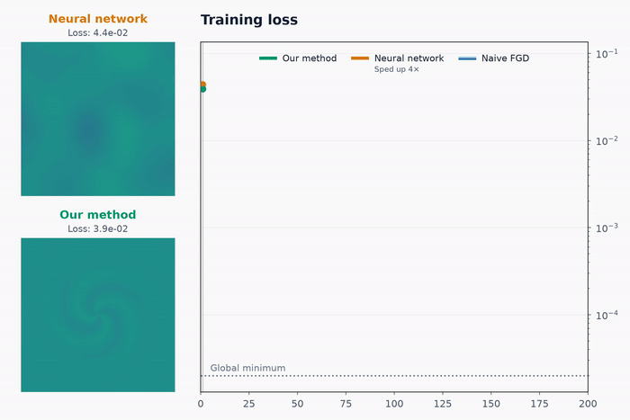

<p align="center">
    <h1 align="center">Functional Gradient Descent with Adaptive Representations</h1>
</p>

<p align="center">
    
</p>

Published at NeurIPS 2026. ([paper link](https://arxiv.org/abs/2606.16926))  

> **Abstract:**  
> Functional optimization problems are typically solved by optimizing the parameters of a fixed representation, such as a neural network, resulting in highly nonconvex losses that complicate both training and theoretical analysis.
> An interesting alternative is functional gradient descent (FGD), that is, gradient descent directly in function space, which benefits from strong convergence results and admits a clean theory.
> However, FGD is difficult to implement in practice because functional gradients are infinite-dimensional, and thus cannot be fully computed nor stored in memory.
> Existing implementations therefore rely on fixed approximations, which introduce approximation error.
> We propose a new, theoretically-grounded FGD algorithm that adapts the representation of the functional gradients over the course of optimization.
> By explicitly incorporating this approximation into the analysis, we establish convergence to a stationary point (for smooth losses) and to a global minimizer (under smoothness + a Polyak-Lojasiewicz-type condition) regardless of our approximations.
> To the best of our knowledge, this is the first implementable FGD method with such guarantees in a general setting.
> We demonstrate the effectiveness of our method on regression, numerical solution of PDEs, and modern computer vision.
> Across settings, our method consistently outperforms both FGD with fixed approximations and neural network baselines in efficiency and accuracy.

## Contents

This repository contains the code to reproduce the results of all experiments and figures in the paper:

- The code for Figure 1 is in `src/teaser`;
- The code for Figure 2 is in `src/kernel-regression`;
- The code for Figure 3 is in `src/wave-equation`; and
- The code for Figure 4 is in `src/functional_radiance`.

Note that the `functional_radiance` code involves a CUDA kernel for the renderer -- to compile it, run `uv run make`.
The `install.sh` script may also be useful to install a compatible CUDA toolchain.

Dependencies are managed via [UV](https://docs.astral.sh/uv/); for information on using UV, see its [Getting started](https://docs.astral.sh/uv/getting-started/) page.

## Citing

```bibtex
@misc{csillag2026adaptivefgd,
      title={Functional Gradient Descent with Adaptive Representations}, 
      author={Daniel Csillag and Rodrigo Schuller and Pedro Dall'Antonia and Leonidas Guibas and Luiz Velho and Tiago Novello},
      year={2026},
      eprint={2606.16926},
      archivePrefix={arXiv},
      primaryClass={math.OC},
      url={https://arxiv.org/abs/2606.16926},
}
```
